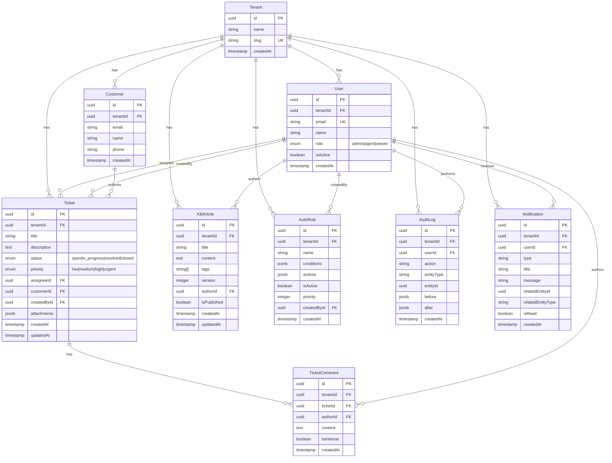

# AICC Mini - Database

## 전체 엔티티 관계도 (ERD)



---

## 엔티티별 필드 정의

### Tenant

| 컬럼 | 타입 | 제약 | 설명 |
|------|------|------|------|
| id | uuid | PK, default gen | 테넌트 ID |
| name | varchar(100) | NOT NULL | 조직명 |
| slug | varchar(50) | UNIQUE, NOT NULL | URL용 식별자 |
| createdAt | timestamp | default now() | 생성일 |

### User

| 컬럼 | 타입 | 제약 | 설명 |
|------|------|------|------|
| id | uuid | PK, default gen | 사용자 ID |
| tenantId | uuid | FK → Tenant | 소속 테넌트 |
| email | varchar(255) | UNIQUE, NOT NULL | 이메일 (로그인 ID) |
| name | varchar(100) | NOT NULL | 표시 이름 |
| role | enum | NOT NULL, default 'viewer' | admin / agent / viewer |
| isActive | boolean | default true | 비활성화 여부 |
| createdAt | timestamp | default now() | 가입일 |

### Customer

| 컬럼 | 타입 | 제약 | 설명 |
|------|------|------|------|
| id | uuid | PK, default gen | 고객 ID |
| tenantId | uuid | FK → Tenant | 소속 테넌트 |
| email | varchar(255) | NOT NULL | 고객 이메일 |
| name | varchar(100) | NOT NULL | 고객명 |
| phone | varchar(50) | nullable | 연락처 |
| createdAt | timestamp | default now() | 등록일 |

### Ticket

| 컬럼 | 타입 | 제약 | 설명 |
|------|------|------|------|
| id | uuid | PK, default gen | 티켓 ID |
| tenantId | uuid | FK → Tenant | 소속 테넌트 |
| title | varchar(255) | NOT NULL | 제목 |
| description | text | NOT NULL | 상세 내용 |
| status | enum | NOT NULL, default 'open' | open / in_progress / resolved / closed |
| priority | enum | NOT NULL, default 'medium' | low / medium / high / urgent |
| assigneeId | uuid | FK → User, nullable | 담당 에이전트 |
| customerId | uuid | FK → Customer, nullable | 티켓 요청 고객 |
| createdById | uuid | FK → User, NOT NULL | 티켓 생성자 |
| attachments | jsonb | default '[]' | [{url, name, size}] 배열 |
| createdAt | timestamp | default now() | 생성일 |
| updatedAt | timestamp | default now(), onUpdate | 최종 수정일 |

### TicketComment

| 컬럼 | 타입 | 제약 | 설명 |
|------|------|------|------|
| id | uuid | PK, default gen | 댓글 ID |
| tenantId | uuid | FK → Tenant | 소속 테넌트 |
| ticketId | uuid | FK → Ticket, CASCADE DELETE | 부모 티켓 |
| authorId | uuid | FK → User | 작성자 |
| content | text | NOT NULL | 내용 |
| isInternal | boolean | default false | true = 내부메모 (고객에게 비공개) |
| createdAt | timestamp | default now() | 작성일 |

### KBArticle

| 컬럼 | 타입 | 제약 | 설명 |
|------|------|------|------|
| id | uuid | PK, default gen | 문서 ID |
| tenantId | uuid | FK → Tenant | 소속 테넌트 |
| title | varchar(255) | NOT NULL | 제목 |
| content | text | NOT NULL | 본문 (마크다운) |
| tags | text[] | default '{}' | 태그 배열 |
| version | integer | NOT NULL, default 1 | 버전 번호 (수정 시 +1) |
| authorId | uuid | FK → User | 최종 수정자 |
| isPublished | boolean | default true | 공개 여부 |
| createdAt | timestamp | default now() | 생성일 |
| updatedAt | timestamp | default now(), onUpdate | 최종 수정일 |

### AutoRule

| 컬럼 | 타입 | 제약 | 설명 |
|------|------|------|------|
| id | uuid | PK, default gen | 룰 ID |
| tenantId | uuid | FK → Tenant | 소속 테넌트 |
| name | varchar(100) | NOT NULL | 룰 이름 |
| conditions | jsonb | NOT NULL | 매칭 조건 (아래 참조) |
| actions | jsonb | NOT NULL | 실행 액션 (아래 참조) |
| isActive | boolean | default true | 활성 여부 |
| priority | integer | default 0 | 낮을수록 먼저 실행 |
| createdById | uuid | FK → User | 생성자 |
| createdAt | timestamp | default now() | 생성일 |

**conditions JSONB 구조:**
```json
{
  "keywords": ["긴급", "서버 다운"],
  "priority": "high"
}
```

**actions JSONB 구조:**
```json
{
  "assignTo": "user-uuid",
  "setStatus": "in_progress"
}
```

### AuditLog

| 컬럼 | 타입 | 제약 | 설명 |
|------|------|------|------|
| id | uuid | PK, default gen | 로그 ID |
| tenantId | uuid | FK → Tenant | 소속 테넌트 |
| userId | uuid | FK → User | 수행자 |
| action | varchar(100) | NOT NULL | 액션명 (예: ticket.create) |
| entityType | varchar(50) | NOT NULL | 대상 엔티티 타입 |
| entityId | uuid | NOT NULL | 대상 엔티티 ID |
| before | jsonb | nullable | 변경 전 상태 |
| after | jsonb | nullable | 변경 후 상태 |
| createdAt | timestamp | default now() | 기록 시각 |

### Notification

| 컬럼 | 타입 | 제약 | 설명 |
|------|------|------|------|
| id | uuid | PK, default gen | 알림 ID |
| tenantId | uuid | FK → Tenant | 소속 테넌트 |
| userId | uuid | FK → User | 수신자 |
| type | varchar(50) | NOT NULL | ticket.assigned / ticket.status_changed |
| title | varchar(255) | NOT NULL | 알림 제목 |
| message | text | NOT NULL | 알림 메시지 |
| relatedEntityId | uuid | nullable | 관련 엔티티 ID |
| relatedEntityType | varchar(50) | nullable | ticket / kb_article 등 |
| isRead | boolean | default false | 읽음 여부 |
| createdAt | timestamp | default now() | 생성일 |

---

## 키 네이밍 규칙

| 항목 | 규칙 | 예시 |
|------|------|------|
| 테이블명 | PascalCase (Drizzle 관례) | `tickets`, `kb_articles` |
| 컬럼명 | camelCase (Drizzle) → snake_case (DB) | `tenantId` → `tenant_id` |
| PK | 모든 테이블 `id` (uuid) | `id` |
| FK | `{참조테이블단수}Id` | `ticketId`, `tenantId` |
| 열거형 | snake_case 값 | `in_progress`, `kb_article` |
| 인덱스 | `idx_{table}_{column}` | `idx_tickets_tenant_id` |

**권장 인덱스:**
- `tickets(tenant_id, status)` — 상태별 필터링
- `tickets(tenant_id, assignee_id)` — 담당자별 조회
- `kb_articles(tenant_id)` + GIN index on `tags` — 태그 검색
- `audit_logs(tenant_id, created_at)` — 날짜 범위 조회
- `notifications(user_id, is_read)` — 미읽음 조회

---

## 관계 처리 방식

### DB 연결 방식

- **호스팅**: Supabase (hosted PostgreSQL) — Docker 불필요
- **연결**: `DATABASE_URL` 환경변수 (Supabase 프로젝트 Settings → Database → URI)
- **ORM**: Drizzle ORM — Supabase JS SDK 미사용, 직접 PostgreSQL 연결
- **마이그레이션**: `drizzle-kit push` 로 Supabase DB에 스키마 적용

### Drizzle ORM 관계 정의

- `relations()` 함수로 관계 선언 (`schema.ts` 내)
- 조인이 필요한 조회: `db.query.tickets.findMany({ with: { assignee: true } })`
- 복잡한 집계: raw SQL (`sql` 템플릿 태그) 사용

### CASCADE 규칙

| 관계 | 규칙 |
|------|------|
| Ticket 삭제 | TicketComment CASCADE DELETE |
| Tenant 삭제 | 지원하지 않음 (시스템 운영 중 삭제 없음) |
| User 삭제 | assigneeId → SET NULL |

### 멀티테넌트 격리

- **모든 쿼리**에 `where(eq(table.tenantId, tenantId))` 필수
- `src/lib/tenant.ts` 의 `getTenantId(session)` 헬퍼로 추출
- 서비스 함수 첫 번째 인자로 `tenantId` 항상 전달
- Cross-tenant 데이터 접근 시 `ForbiddenError` throw
